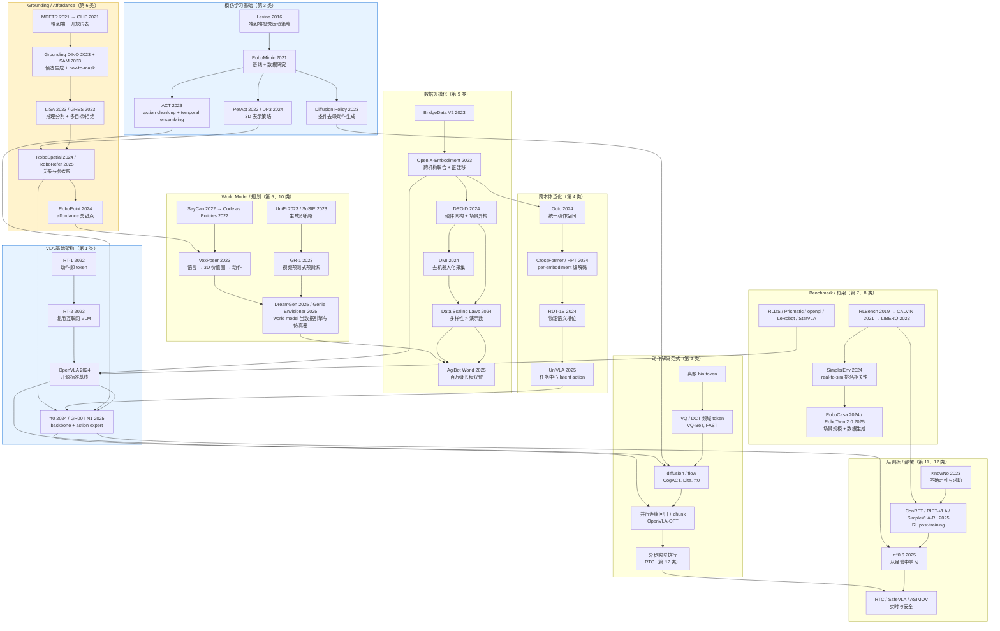

# A. 全领域演进总览

## A.1 Mermaid 演进图

> **图例**：黄色为本库研究重点（grounding / affordance）；蓝色为方法主干；箭头表示"继承或直接推动"，不表示时间先后。

## A.2 五条主关系链（表格形式）

| 关系链 | 起点 | 中间环节 | 终点 | 目前的瓶颈在哪一环 |
|---|---|---|---|---|
| **模仿学习基础 → VLA 基础架构 → 动作生成范式** | Levine 2016 端到端视觉运动策略 | RoboMimic 给出基线与数据认知 → ACT 引入 chunk → Diffusion Policy 引入条件生成 → RT-2/OpenVLA 换上 VLM 骨干 | π0 / GR00T N1 的 backbone + action expert；OpenVLA-OFT 的并行连续回归 | **动作头已基本收敛（chunk + 连续/flow），瓶颈上移到"语义能力在动作微调后退化"与"多帧历史融合"** |
| **数据规模化 → 跨本体泛化** | BridgeData V2 单实验室多样性 | Open X-Embodiment 证明跨本体正迁移 → DROID 提供同构大数据 → UMI 降低采集成本 → Data Scaling Laws 给出"多样性优先"原则 | Octo / CrossFormer / HPT / RDT-1B / UniVLA 的四种本体对齐方案；AgiBot World 的工业化采集 | **缺少"本体相似度度量"与"数据配比原则"；真正的形态迁移（单臂→人形）证据仍弱** |
| **grounding / affordance → object-centric manipulation** | MDETR / GLIP 的开放词表短语 grounding | Grounding DINO 出候选 + SAM 出 mask → LISA 加入推理 → GRES 引入多目标/拒绝 → RoboSpatial / RoboRefer 引入关系与参考系 | RoboPoint 的 affordance 关键点 → VoxPoser 的 3D 价值图 → SpatialVLA 的空间动作栅格 | **关系消歧、同类实例区分、遮挡推理仍未解决；置信度不可校准，无法做可靠的候选验证与伪标签过滤（本库主攻方向）** |
| **world model / planning → 长程任务执行** | SayCan 的语义 × 可行性 | Code as Policies 生成程序 → VoxPoser 生成价值图 → UniPi/SuSIE 生成子目标 → GR-1 把生成变为预训练目标 → ECoT 把推理写进 VLA | π0.5 的"子任务 + 动作"两阶段；Gemini Robotics 1.5 的多层推理与 Motion Transfer；DreamGen / Genie Envisioner 把世界模型变为数据与仿真设施 | **闭环重规划的触发条件、长时记忆、推理链与动作的一致性；生成视频的物理一致性与评测保真度** |
| **benchmark / framework → 训练、评测与部署闭环** | RLBench 提供任务库 | CALVIN 长程语言 → LIBERO 四轴诊断 → SimplerEnv real-to-sim → RoboCasa / RoboTwin 2.0 场景与数据生成；RLDS/Prismatic → OpenVLA → openpi → LeRobot → StarVLA | 训练可复现、权重可下载、真机可部署；RTC 解决延迟；SafeVLA / ASIMOV 引入安全维度 | **LIBERO 已饱和、扰动鲁棒性评测未成共识；数据格式仍分裂（RLDS vs LeRobotDataset）；成功率之外的指标（延迟、安全、平滑度）几乎无人报告** |

## A.3 时间轴速览

| 时期 | 标志性事件 | 领域主要问题 |
|---|---|---|
| 2016–2021 | 端到端视觉运动策略、RoboMimic、CLIPort/PerAct | 能不能从像素学出策略；人类演示数据怎么用 |
| 2022–2023 | RT-1 / RT-2、SayCan、Diffusion Policy、ACT、Open X-Embodiment | 能不能把互联网 VLM 的语义带进控制；数据能不能跨机构合并 |
| 2024 | OpenVLA、Octo、π0、DROID、UMI、LIBERO 成为标准 | 开源可复现；动作表示从离散转向连续；数据采集成本下降 |
| 2025 | π0.5、GR00T N1、OpenVLA-OFT、UniVLA、RL post-training 爆发、AgiBot World | 开放世界长程泛化；RL 能否超越模仿；小模型能否可用 |
| 2026（截至 09-08） | 统一训练框架（StarVLA 等）、鲁棒性与安全 benchmark、world-action 统一模型 | **评测可信度**与**部署可行性**成为主要矛盾；论文数量激增但证据质量参差 |

> **趋势判断（供参考，非结论）**：2026 年的公开工作重心已从"提出新架构"转向"**让结果可比、可复现、可部署**"。对个人研究选题而言，**评测方法学**与**未被度量的维度**（置信度、失败检测、语义安全、指代消歧）比再提一个动作头更有空间。
